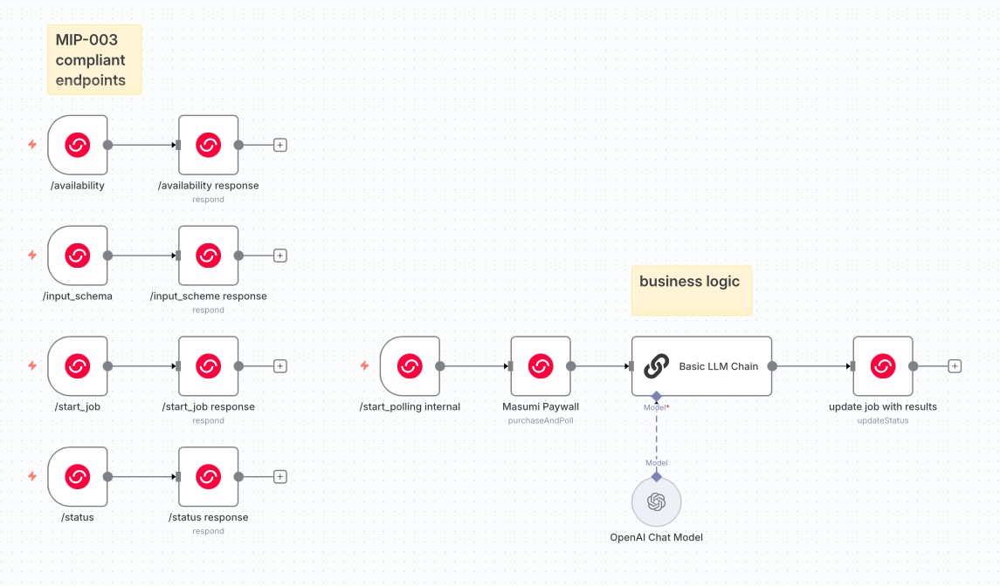
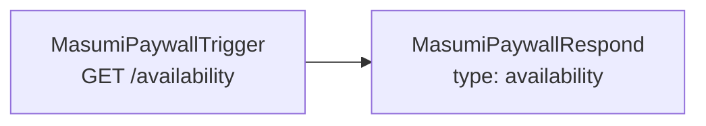
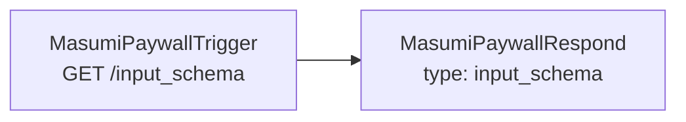
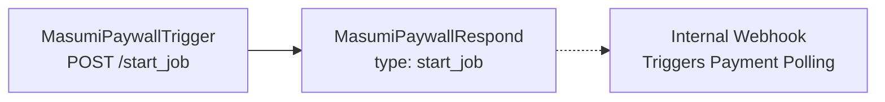
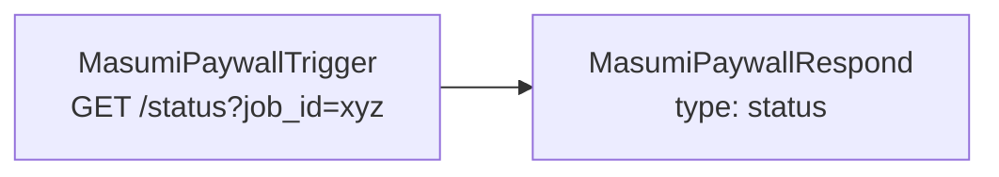
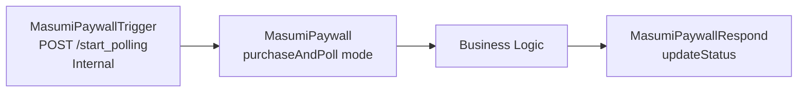
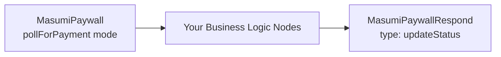

# n8n-nodes-masumi-payment

> This is the official Masumi n8n community node that provides Cardano blockchain paywall functionality for monetizing n8n workflows on Masumi Network. 

## Installation
### Option 1: n8n Community Nodes (Recommended)
> Requires self-hosting n8n instance according to official [n8n docs](https://docs.n8n.io/integrations/community-nodes/installation/). 
1. Go to Settings → Community Nodes in your n8n instance
2. Click "Install a community node" and search for: `n8n-nodes-masumi-payment`
3. Confirm checkbox and click "Install"

### Option 2: Manual Installation
```bash
# in your n8n installation directory
npm install n8n-nodes-masumi-payment

# Restart n8n
```

## Prerequisites

1. **Masumi Payment Service**: You need a running [Masumi payment service](https://docs.masumi.network/documentation/get-started/installation) instance
You can get one up and running in less than 5 minutes by deploying on Railway

    [](https://railway.com/deploy/masumi-payment-service-official?referralCode=pa1ar)

2. **Top up your wallets**: you need ADA on your selling wallet for registering an agent, you need ADA also on your buying wallet to test the full flow. Get test-Ada on [Masumi ADA faucet](https://dispenser.masumi.network/) or on [Cardano faucet](https://docs.cardano.org/cardano-testnets/tools/faucet).
2. **Register an agent**: you need to register an agent on Masumi registry. Use your main n8n workflow URL and register an agent with your Masumi payment service. [Read more](https://docs.masumi.network/core-concepts/registry). By registering your agent you provide the price of the execution, description, example outputs etc.
3. **Prepare your credentials**: you will need to provide your *Masumi Payment service admin key*, *agent identifier*, *vkey* - selling wallet verification key to the Masumi Payment node. You can get all those keys from the dashboard on your own running Masumi Payment service.

## Configuration

1. In n8n, go to Credentials → Add Credential
2. Search for "Masumi Paywall API" in the dropdown
3. Configure:

| Field | Description |
|-------|-------------|
| Payment Service URL | Base URL of your Masumi service |
| API Key | Your Masumi service API key |
| Agent Identifier | Your registered agent ID |
| Seller Verification Key | Cardano wallet verification key |
| Network | `Preprod` (testnet) or `Mainnet` |

## 3-Node System Architecture

> This package provides you with three specialized nodes for building complete payment-gated workflows.

### Node Types

1. **Masumi Paywall Trigger** - Webhook receiver for external requests
2. **Masumi Paywall Respond** - Responds to webhooks, also creates/updates jobs
3. **Masumi Paywall** - Handles payment polling and workflow execution

Each node type provides a user-friendly mostly dropdown-driven operation mode selection or output templates. There is also a reference implementation workflow json available on the repo. Consider using it as starter point.

### Job Storage System

Jobs are stored in **n8n static data** (`this.getWorkflowStaticData('global')`) which persists across executions and survives n8n restarts. Each job contains:

```typescript
interface Job {
  job_id: string;                    // Unique 14-character hex identifier
  identifier_from_purchaser: string; // Hex-encoded user identifier  
  input_data: Record<string, any>;   // Parsed input parameters
  status: 'pending' | 'awaiting_payment' | 'awaiting_input' | 'running' | 'completed' | 'failed'; // Job lifecycle
  payment?: {                        // Payment details (when created)
    blockchainIdentifier: string;
    inputHash: string;
    payByTime: string;              // String timestamp
    submitResultTime: string;       // String timestamp
    unlockTime: string;             // String timestamp
    externalDisputeUnlockTime: string; // String timestamp
  };
  result?: any;                      // Business logic output
  error?: string;                    // Error message if failed
  created_at: string;               // ISO timestamp
  updated_at: string;               // ISO timestamp
}
```

### Required Workflow Architecture

> You need to create **5 separate endpoints** with mini-workflows for complete [MIP-003](https://github.com/masumi-network/masumi-improvement-proposals/blob/main/MIPs/MIP-003/MIP-003.md) compliance. 

The endpoints should provide MIP-003 compliant responses, hence you must connect triggers to the respond nodes. The triggers and response nodes are separated to give you flexibility.

> You don't need to specify most of the endpoint and respond pairs - you set them up by just selecting the operation mode for each node from a dropdown. The 3-nodes-architecture is basically Lego™ and if you read the descriptions you are going to connect everything correctly by just following common sense and MIP-003.

**Split Workflow Architecture**: Starting from v0.5.0, jobs are immediately accessible after creation via a split workflow design that separates job creation from payment polling for better responsiveness. 



#### 1. `/availability` endpoint
**Purpose**: Health check to confirm agent is online (you can manually select `unavailable` from a dropdown)


**Response**:
```json
{
  "status": "success", 
  "availability": "available"
}
```

#### 2: `/input_schema` endpoint  
**Purpose**: Return input schema for the agent - this one you need to specify manually according to your business logic and agentic workflow functionality


**Response**:
```json
{
  "status": "success",
  "input_schema": {
    "prompt": {
      "type": "string", 
      "description": "Text to process"
    }
  }
}
```

#### 3: `/start_job` endpoint
**Purpose**: Create payment request and job, return payment details immediately; automatically triggers internal payment polling in background


**Input**:
```json
{
  "identifier_from_purchaser": "user123",
  "input_data": [
    {"key": "prompt", "value": "analyze this text"}
  ]
}
```

**Response**:
```json
{
  "status": "success",
  "job_id": "a1b2c3d4e5f678",
  "blockchainIdentifier": "very_long_blockchain_id...",
  "paybytime": 1756129851,
  "submitResultTime": 1756130751,
  "unlockTime": 1756152351,
  "externalDisputeUnlockTime": 1756173951,
  "agentIdentifier": "agent_id...",
  "sellerVKey": "seller_verification_key",
  "identifierFromPurchaser": "757365723132333",
  "amounts": [{"amount": "4200000", "unit": ""}],
  "input_hash": "sha256_hash_of_input_data",
  "_internal_webhook_triggered": "fire-and-forget"
}
```

#### 4: `/status` endpoint
**Purpose**: Return current job status and results (in case the job was fulfilled)


**Response (Awaiting Payment)** - status is immediately accessible after starting the job:
```json
{
  "job_id": "a1b2c3d4e5f678",
  "status": "awaiting_payment",
  "paybytime": 1756143592,
  "message": "Waiting for payment confirmation on blockchain"
}
```

**Response (Running)** - status is set after payment is confirmed:
```json
{
  "job_id": "a1b2c3d4e5f678",
  "status": "running"
}
```

**Response (Completed)** - status is set after the business logic has been fulfilled (you define what complete means and when to respond this status):
```json
{
  "job_id": "a1b2c3d4e5f678",
  "status": "completed",
  "paybytime": 1756143592,
  "result": {
    "text": "Business logic output here..."
  },
  "message": "Job completed successfully"
}
```

#### 5: `/start_polling` endpoint (Internal)
**Purpose**: Internal webhook triggered automatically after job creation to handle payment polling separately


**Input** (Automatically sent by MasumiPaywallRespond):
```json
{
  "job_id": "a1b2c3d4e5f678"
}
```

This endpoint enables the split workflow architecture where:
1. Job creation completes immediately (jobs become accessible)
2. Payment polling runs as a separate background process
3. No blocking operations in the job creation flow

### Business Logic

Add your actual business logic by wrapping it with Masumi Paywall on the input and Masumi Paywall Respond on the output:


> In the reference template, the Basic LLM Chain is playing a role of a "business logic". Consider replacing this block with your full business logic or a shortcut to a separate n8n workflow.

### **The Flow** (Split Workflow Architecture v0.5.0+):
1. **Job Created**: `/start_job` endpoint creates payment request and job, returns immediately with fire-and-forget webhook triggering
2. **Job Accessible**: Job status is immediately available via `/status` endpoint (no longer blocked)  
3. **Internal Polling**: MasumiPaywallRespond automatically triggers `/start_polling` internal webhook
4. **Payment Polling**: Separate workflow polls Masumi Payment service for payment confirmation
5. **Status Update**: Job status changes `awaiting_payment` → `running` when payment detected
6. **Payment Confirmed**: Once `FundsLocked` is detected, business logic workflow starts
7. **Business Logic**: Your actual processing (LLM, API calls, data transformation) happens
8. **Result Storage**: MasumiPaywallRespond saves result and updates status to `completed`
9. **Getting Results**: Consumer can get results by checking status with `job_id`

**Key Improvement**: Jobs are no longer "not found" immediately after creation - they're accessible with `awaiting_payment` status right away.

### Integration with External Systems

**Sokosumi Marketplace Integration**:
1. User clicks "hire" in Sokosumi after filling out the form (your `input_data`)
2. Sokosumi calls your `/start_job` → Creates payment request → Job immediately accessible  
3. Internal webhook automatically starts payment polling in background
4. Sokosumi handles blockchain payment using returned payment data
5. Background polling detects `FundsLocked` → Starts business logic workflow
6. Sokosumi polls `/status` → Gets results when completed

**Direct API Integration**:
1. External system calls `/start_job` → Gets payment details → Job immediately accessible
2. Background payment polling automatically starts
3. External system or user manually sends funds to blockchain
4. Background polling detects payment → Processes job → Returns results via `/status`

## Error Behavior

**Important**: MasumiPaywall node throws `NodeOperationError` when payment fails or times out, causing the workflow to show as failed (red) in n8n and preventing execution of subsequent nodes until payment is confirmed. This behavior occurs unless "Continue on Fail" is enabled in node settings.

## Payment States

- `FundsLocked` - Payment confirmed, workflow continues
- `null` - Payment pending, most likely you are still polling via MasumiPaywall node
- Error states (workflow fails): `FundsOrDatumInvalid`, `RefundRequested`, `Disputed`, `RefundWithdrawn`, `DisputedWithdrawn`

## Development

```bash
npm install && npm run build && npm run lint
```

You probably want to clean the npm nodes cache on n8n and restart your n8n instance if you are updating this package. Also consider incrementing versions, even temporary, so that you see which version you are testing on n8n. 

Test standalone functions:
```bash
# Test payment status polling
node dist/nodes/MasumiPaywall/check-payment-status.js --blockchain-identifier <id>
```

## License

MIT License